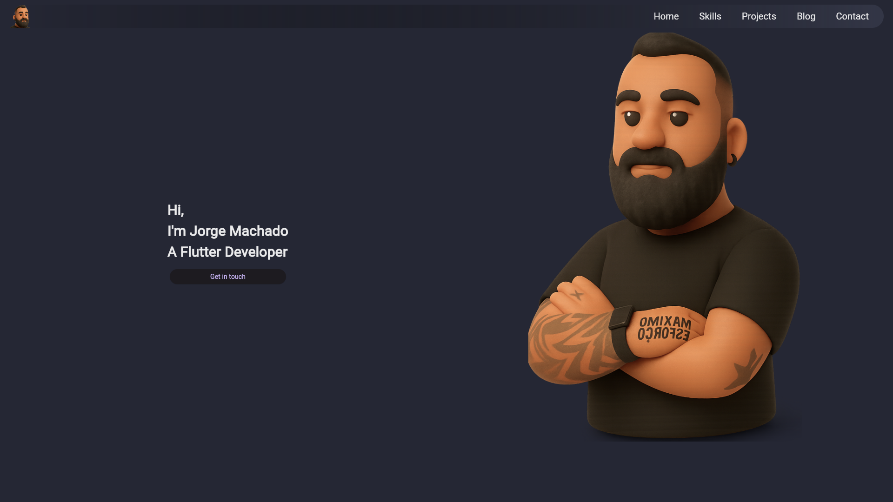
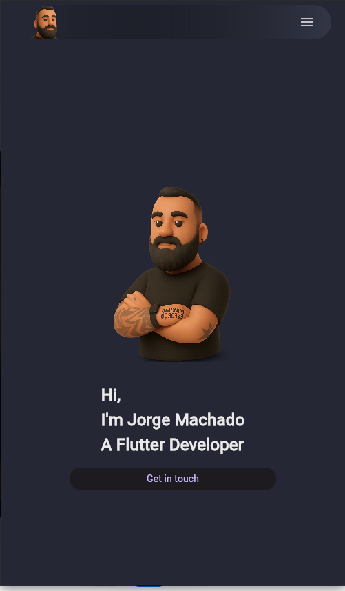

# My Flutter Portfolio





## 🚀 About This Project

This is my personal portfolio, developed entirely with Flutter. The main goal of this project was to apply and deepen my knowledge in responsive web development using the technologies I work with daily. As a developer in career transition, this portfolio serves as a practical showcase of my current skills in creating modern and accessible interfaces.

The project is designed to be fully responsive, offering an optimized experience for both desktop and mobile devices.

---

## ✨ Features

- **Fully Responsive:** Adapts seamlessly to different screen sizes, from mobile to desktop.
- **Smooth Scrolling & Animations:** Implemented scroll-to-section navigation and subtle on-scroll animations for a better user experience.
- **Dynamic Content:** Includes sections for skills, projects, and a functional contact form.
- **Clean Architecture:** Components are separated into individual widgets for better organization and reusability.

---

## 🛠️ Technologies Used

This project was built using the following technologies:

- **Framework:** [Flutter](https://flutter.dev/) (version 3.32.8)
- **Language:** [Dart](https://dart.dev/)
- **Key Packages:**
  - `url_launcher` for opening external links.
  - `gap` for spacements

---

##  Getting Started

This is a standard Flutter project. To get a local copy up and running, follow these simple steps.

### Prerequisites

- You need to have Flutter SDK installed. For instructions, see the [official documentation](https://docs.flutter.dev/get-started/install).

### Installation

1.  Clone the repo:
    ```sh
    git clone [https://github.com/MachadoJorgeH/flutter_portfolio.git](https://github.com/MachadoJorgeH/flutter_portfolio.git)
    ```
2.  Navigate to the project directory:
    ```sh
    cd flutter_portfolio
    ```
3.  Install dependencies:
    ```sh
    flutter pub get
    ```
4.  Run the app (e.g., on Chrome):
    ```sh
    flutter run -d chrome
    ```

---

## Contact

Jorge Henrique Machado - [jorgehenriqueq@gmail.com](mailto:jorgehenriqueq@gmail.com)

Project Link: [https://github.com/MachadoJorgeH/flutter_portfolio](https://github.com/MachadoJorgeH/flutter_portfolio)